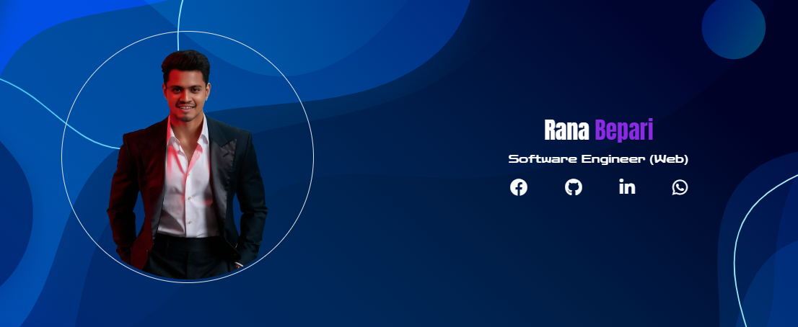

# Assalamualaikum! 👋

This is **Rana Bepari**, a passionate **Software Engineer** with a **B.Sc. in Electronics and Communication Engineering (ECE)**. I have developed my skills in multiple programming languages and frameworks, including:

**Backend & Web:** PHP, Laravel, WordPress (Bug Fixing & Development)  
**Frontend:** HTML, CSS, JavaScript  
**Mobile & Apps:** Java, Android Studio  
**Other Skills:** API Development, Collabration With Unity Game, SEO-friendly Web Development, **Realtime Web Socket**, **Cloud VPS Management** (AWS, DigitalOcean, Hetzner, Time4VPS) & **Laravel Deployment**

---

## 💼 Experience & Projects

I have **1.5 years of professional IT company experience** and **1+ years of freelance experience** working on various projects. Some highlights include:

**Professional IT Experience**  
- **Laravel Web Applications** – Features include:  
  - Multi-authentication panels  
  - Advanced backend functionality  
  - Secure & modular design  
  - Realtime data insert & update  
  - REST APIs for web and mobile apps  
  - Laravel to Android notifications  
  - Unity & Android game collaboration  

**Freelance Experience**  
- **WordPress Developer** – Resolved client issues and developed features on [Fiverr](https://www.fiverr.com/me_rana)  

**Project Highlights:**  
- **Newspaper Website** – Responsive and user-friendly news platform  
- **Game Backend** – Laravel APIs integrated with Unity for real-time gameplay  
- **Requisition & Stock Management System** – Full-stack workflow and inventory management  
- **Package & Appointment Management System** – Appointment booking & certificate verification  
- **Android & App Development** – App features, landing pages, and API integration  
- **Custom Web Applications** – Tailored client solutions with APIs for web, iOS, and Android  

I also enjoy experimenting with **Android app development** using **Android Studio** as side projects and learning experiences.  

You can find some examples of my work under the **Samples** menu on my website.  

---

## 🛠️ Skills Summary

**Programming & Frameworks:** PHP, Laravel, WordPress, Java, JavaScript, HTML, CSS  
**Databases:** MySQL, Room Database  
**Tools & Architecture:** MVC, Retrofit, Git, REST API  
**Web Development:** Responsive & SEO-friendly websites, E-commerce, Blog, Portfolio, Custom Apps  
**Game Development:** Collabrotation With Unity Game through Laravel Api's

---

## 📫 Contact Me

**🌐 Website:** [https://rana.com.bd](https://rana.com.bd)  
**📧 Email:** [contact@rana.com.bd](mailto:contact@rana.com.bd)  
**💼 LinkedIn:** [https://www.linkedin.com/in/rana-bepari](https://www.linkedin.com/in/rana-bepari)  
**🖥️ Fiverr:** [https://www.fiverr.com/me_rana](https://www.fiverr.com/me_rana)  

---

> ⚠️ **Note:** I used Gitlab for Production Level Projects.

---

Thanks for visiting!  
**— Rana Bepari**
