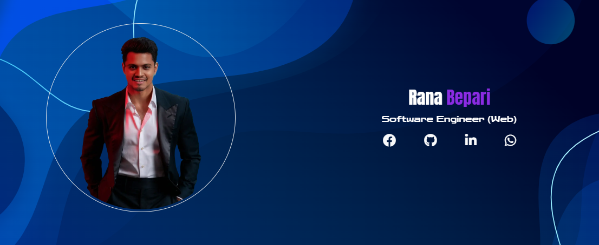

# Assalamualaikum! 👋

This is **Rana Bepari**, a passionate Software Engineer (Junior) with a B.Sc. in Electronics and Communication Engineering (ECE). I have recently developed my skills in several programming languages including:

- PHP
- HTML
- CSS
- JavaScript
- Java
- Laravel
- WordPress (Bug Fixing & Development)

## 💼 Experience & Projects

Previously, I worked as a **WordPress Developer** on [Fiverr](https://www.fiverr.com), where I resolved various WordPress-related issues for clients.

Currently, I am actively working on **Laravel web applications**, with features like:

- Multi-authentication panels
- Advanced backend functionality
- Secure & modular design

You can find some examples of my work under the **Samples** menu on my website.

I also enjoy experimenting with **Android app development** using **Android Studio** as a side project and learning experience.

## 📫 Contact Me

- 🌐 Website: [https://rana.com.bd](https://rana.com.bd)
- 📧 Email: [contact@rana.com.bd](mailto:contact@rana.com.bd)

---

> ⚠️ **Note:** Due to production-level confidentiality, some of my projects are private.

---

Thanks for visiting!  
**— Rana Bepari**
